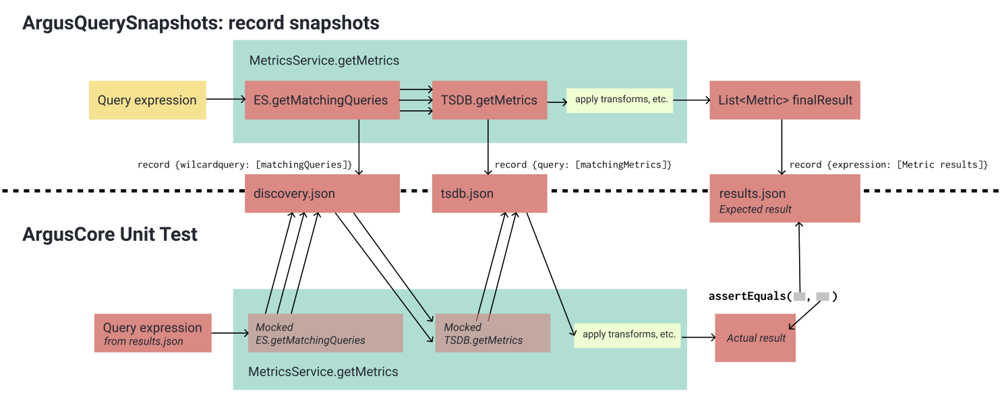

# ArgusQuerySnapshots

## Usage
```
cd /path/to/ArgusQuerySnapshots
mvn package

./run.sh
```

## What is this?
A utility for **regression testing** that generates static snapshots, meant for test mocking, from live Argus data. 

**Note: The `argus-core` version is unlinked from the parent / project-wide version. This is intentional, and the version and the JSONs should only be updated when MetricQueryProcessor or a transform's behavior changes, or there is a new transform**

The snapshots consist of three JSON files that capture results from external components:
* `MetricServiceSnapshotTest.discovery.json` - Intermediate Elasticsearch results
* `MetricServiceSnapshotTest.tsdb.json` - Intermediate TSDB results
* `MetricServiceSnapshotTest.results.json` - Query expressions and their expected Metric entity results

The discovery and TSDB results are loaded as mocks in the MetricServiceSnapshotTest unit test. 

Here is a diagram that also explains the workings and usage:



